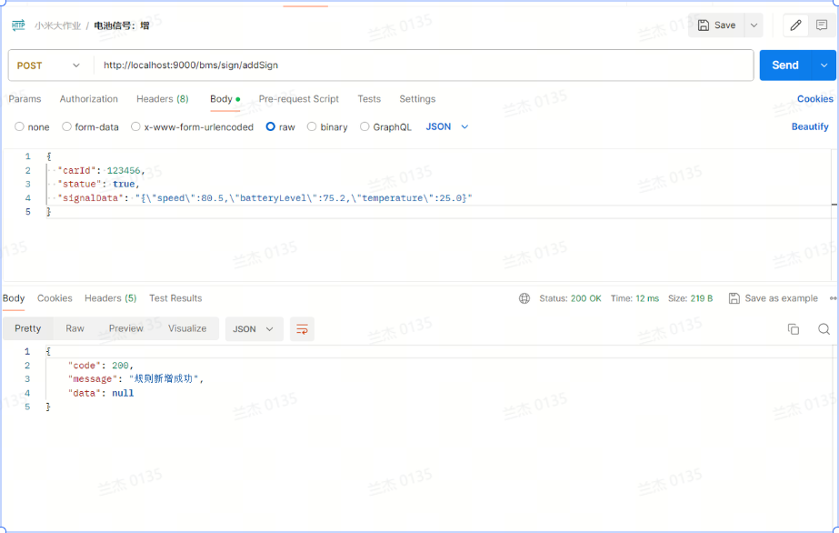

# BMS系统后端设计

## 时序图


## 模块部分（数据库+接口设计）

### 功能模块1

1. 支持**车辆信息**（vid,车架编号,电池类型,总里程(km),电池健康状态(%)）

> 车辆信息录入是因为：先有车才有电池，最后才会在车行驶中产生电流信号
>
> vid: Vehicle Identification 车辆识别码，每辆车唯一，16位随机字符串
>
> 电池类型：三元电池、铁锂电池

作业：

- 设计车辆信息存储的表结构
- 将下面信息存储到汽车信息表中

| **vid**      | **车架编号** | **电池类型** | **总里程(km)** | **电池健康状态(%)** |
| ------------ | ------------ | ------------ | -------------- | ------------------- |
| 自己随机生成 | 1            | 三元电池     | 100            | 100                 |
| 自己随机生成 | 2            | 铁锂电池     | 600            | 95                  |
| 自己随机生成 | 3            | 三元电池     | 300            | 98                  |

#### 车辆信息表结构设计：

```JSON
-- 车辆信息表
CREATE TABLE `vehicle_info` (
  `vid` varchar(16) NOT NULL COMMENT '车辆识别码，16位随机字符串（主键）',
  `car_id` bigint NOT NULL COMMENT '车架编号（数字类型，唯一）',
  `battery_type` enum('三元电池','铁锂电池') NOT NULL COMMENT '电池类型',
  `total_mileage` decimal(10,2) NOT NULL COMMENT '总里程(km)',
  `battery_health` decimal(5,2) NOT NULL COMMENT '电池健康状态(%)',
  PRIMARY KEY (`vid`),
  UNIQUE KEY `idx_car_id` (`car_id`)
) ENGINE=InnoDB DEFAULT CHARSET=utf8mb4 COMMENT='车辆表';
```

#### 接口设计


### 功能模块2

1. **规则**（包括：序号，规则编号，名称，预警规则，电池类型）

   1. > 预警规则：包含预警规则描述以及预警等级（0级最高响应）
      >
      > 电池类型：不同类型电池对应规则不同
      >
      > 信号：Mx（最高电压）,Mi（最小电压）、Ix（最高电流）,Ii（最小电流）

   2. 作业：

   3. - 设计车辆上报信号和规则的存储的表结构
      - 模拟生成车辆上报的信号数据
      - 将以下数据进行存储规则表

规则表

```JSON
-- 修正后的表结构
CREATE TABLE `warning_rule` (
  `id` int NOT NULL AUTO_INCREMENT COMMENT '自增主键',
  `rule_id` int NOT NULL COMMENT '规则编号',
  `rule_name` varchar(50) NOT NULL COMMENT '规则名称',
  `battery_type` enum('三元电池','铁锂电池') NOT NULL COMMENT '电池类型',
  `condition_expression` text NOT NULL COMMENT '预警规则条件表达式',
  PRIMARY KEY (`id`)  
) ENGINE=InnoDB DEFAULT CHARSET=utf8mb4 COMMENT='预警规则表';
```


### 功能模块3

上报电池信号功能

- 考核要求：
  - 能通过接口上报电池信号状态，完成数据库的增删改查

查询电池信号功能

- 考核要求：
  - 查询电池信号状态，要求接口使用Redis做缓存，且保证缓存和数据库数据的一致性

预警功能

- 考核要求：
  - 通过定时任务扫描电池信号数据，通过发送MQ消息，消费MQ消息生成预警信息
  - 支持通过预警接口查询指定车辆的预警信息

电池信号表

```JSON
CREATE TABLE `battery_signal` (
  `id` bigint(20) NOT NULL AUTO_INCREMENT,
  `vehicle_id` bigint(20) NOT NULL COMMENT '车辆ID',
  `vid` varchar(16) NOT NULL COMMENT '车辆识别码',
  `frame_number` varchar(50) NOT NULL COMMENT '车架编号',
  `mx_voltage` decimal(10,2) DEFAULT NULL COMMENT '最高电压',
  `mi_voltage` decimal(10,2) DEFAULT NULL COMMENT '最低电压',
  `ix_current` decimal(10,2) DEFAULT NULL COMMENT '最高电流',
  `ii_current` decimal(10,2) DEFAULT NULL COMMENT '最低电流',
  `signal_time` datetime NOT NULL COMMENT '信号时间',
  `create_time` datetime NOT NULL DEFAULT CURRENT_TIMESTAMP,
  PRIMARY KEY (`id`),
  KEY `idx_vehicle_id` (`vehicle_id`),
  KEY `idx_frame_number` (`frame_number`),
  KEY `idx_signal_time` (`signal_time`)
) ENGINE=InnoDB DEFAULT CHARSET=utf8mb4 COMMENT='电池信号表';

-- 为应对大数据量，考虑按月分表
CREATE TABLE `battery_signal_202301` LIKE `battery_signal`;
CREATE TABLE `battery_signal_202302` LIKE `battery_signal`;
-- 以此类推...
```




### 功能模块4

预警接口（接口文档定义示例）

Server 需要提供以下接口。

- 上报接口

接口名：/api/warn

接口方法：POST

Body：格式为数组，数组内的每个元素包含以下字段。

| 字段   | 类型   | 是否必传 | 含义     | 示例                | 备注                   |
| ------ | ------ | -------- | -------- | ------------------- | ---------------------- |
| carId  | int    | 必须     | 车架编号 | 1                   |                        |
| warnId | int    | 非必须   | 规则编号 | 1                   | 不传时候，遍历所有规则 |
| signal | String | 必须     | 信号     | {"Mx":1.0,"Mi":0.6} |                        |

Body 示例：

```JSON
[
  {
    "carId": 1,
    "warnId": 1,
    "signal": "{\"Mx\":12.0,\"Mi\":0.6}"
  },
  {
    "carId": 2,
    "warnId": 2,
    "signal": "{\"Ix\":12.0,\"Ii\":11.7}"
  }，
   {
    "carId": 3,
    "signal": "{\"Mx\":11.0,\"Mi\":9.6,\"Ix\":12.0,\"Ii\":11.7}"
  }
]
```

接口返回信息：

| 参数名称 | 描述                                                        |
| -------- | ----------------------------------------------------------- |
| code     | 状态码                                                      |
| message  | 请求成功，message 为 "ok"；请求失败，message 为具体报错信息 |
| data     | 报警则返回报警等级，不报警则返回不报警                      |

```JSON
{
    "status": 200,
    "msg": "ok",
    "data": 
        [
            {
                "车架编号": 1,
                "电池类型": "三元电池",
                "warnName": "电压差报警",
                "warnLevel": 0
            },
            {
                "车架编号": 2,
                "电池类型": "铁锂电池",
                "warnName": "电流差报警",
                "warnLevel": 2
            },
            {
                "车架编号": 3,
                "电池类型": "三元电池",
                "warnName": "电压差报警",
                "warnLevel": 2
            },
            {
                "车架编号": 3,
                "电池类型": "三元电池",
                "warnName": "电流差报警",
                "warnLevel": 2
            }
         ]
}
```

预警信息表

```JSON
CREATE TABLE `warning_info` (
  `id` bigint(20) NOT NULL AUTO_INCREMENT,
  `warning_no` varchar(32) NOT NULL COMMENT '预警编号',
  `vehicle_id` bigint(20) NOT NULL COMMENT '车辆ID',
  `vid` varchar(16) NOT NULL COMMENT '车辆识别码',
  `frame_number` varchar(50) NOT NULL COMMENT '车架编号',
  `rule_id` int(11) NOT NULL COMMENT '规则编号',
  `rule_name` varchar(100) NOT NULL COMMENT '规则名称',
  `battery_type` enum('三元电池','铁锂电池') NOT NULL COMMENT '电池类型',
  `warning_level` int(11) NOT NULL COMMENT '预警等级',
  `signal_data` text NOT NULL COMMENT '信号数据',
  `warning_time` datetime NOT NULL COMMENT '预警时间',
  `processed` tinyint(1) DEFAULT '0' COMMENT '是否处理',
  `create_time` datetime NOT NULL DEFAULT CURRENT_TIMESTAMP,
  PRIMARY KEY (`id`),
  KEY `idx_vehicle_id` (`vehicle_id`),
  KEY `idx_frame_number` (`frame_number`),
  KEY `idx_warning_time` (`warning_time`),
  KEY `idx_processed` (`processed`)
) ENGINE=InnoDB DEFAULT CHARSET=utf8mb4 COMMENT='预警信息表';

-- 同样考虑按月分表
CREATE TABLE `warning_info_202301` LIKE `warning_info`;
CREATE TABLE `warning_info_202302` LIKE `warning_info`;
-- 以此类推...
```


## DDD分层架构、

**分层架构解耦，提升系统可维护性**

- 价值：通过标准分层（如四层架构：表现层、应用层、领域层、基础设施层）隔离职责，避免层间依赖混乱。
- 优势：领域层专注业务逻辑，基础设施层封装技术细节（如数据库、消息队列），应用层协调领域服务，使系统更易扩展（如替换数据库不影响领域逻辑）。


### 定期处理+mq生成者+消费者[简单实现了 发送消费 然后失败记录 使用了状态排序 保证优先发送新数据 防止重复处理]

1、并发 涉及到很多 比如乐观锁、分布式锁
2、状态、失败次数（rabbitetmq还有自动重试）


## 飞书地址：

https://wayawbott0.f.mioffice.cn/docx/doxk4x7QKsxsKyvazmNAjrQvuyd

## github

git@github.com:newbirdcoming/xiaomi-work.git


## 问题：
1、对于数据库枚举的映射问题【解决】
2、全局异常类的定义和使用（很多地方存在异常，如何统一管理）【待解决】
3、数据库的定义
4、预警文档的读取
5、提升性能
6、redis作为缓存
7、mq的死信队列


